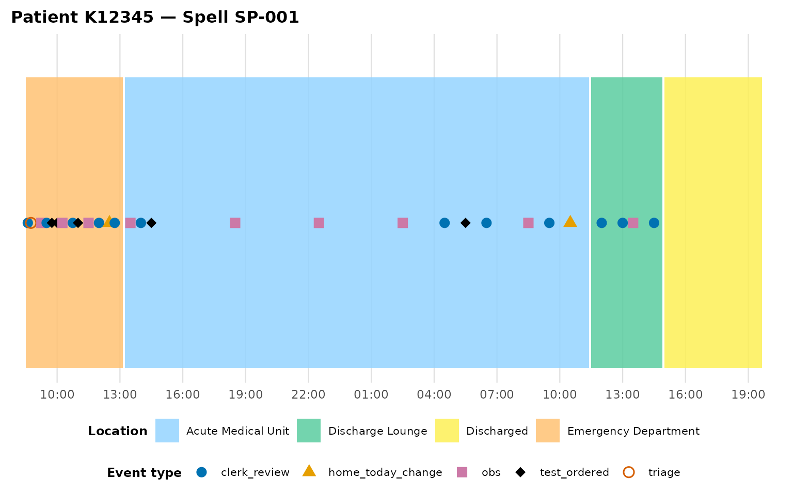
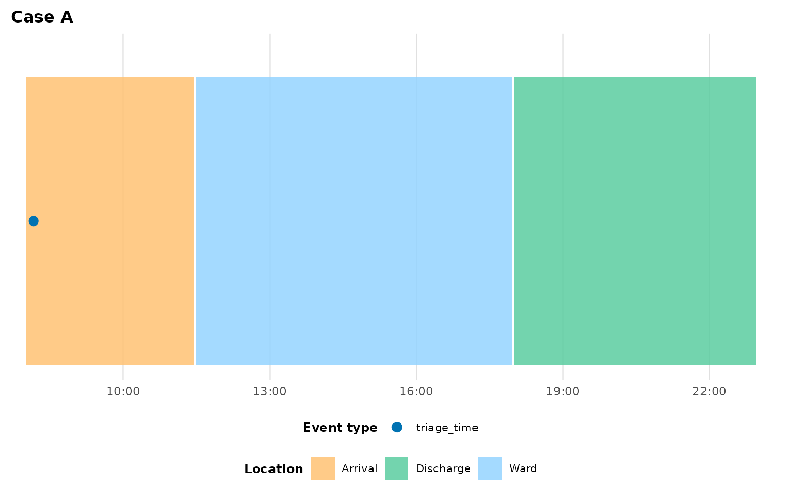

# Adapting your data

``` r

library(eventviz)
```

[`plot_patient_journey()`](https://jaspercain01.github.io/event-driven-visualisation/reference/plot_patient_journey.md)’s
defaults (`case_col = "caseID"`, `time_col = "timestamp"`, …) match
`example_journey`’s column names, but your own data almost certainly
uses different ones — and might not even be in the right *shape* yet.
This vignette covers both problems: matching column names via a schema,
and reshaping wide milestone data into the long form eventviz expects.

## Column-name schemas

You can always pass column names individually:

``` r

plot_patient_journey(
  my_data, case_id = "12345",
  time_col = "ts", case_col = "spell_id", act_type_col = "category",
  activity_col = "label", patient_col = "mrn"
)
```

For a dataset you’ll plot repeatedly, bundle the mapping into an
[`event_log_schema()`](https://jaspercain01.github.io/event-driven-visualisation/reference/event_log_schema.md)
once and reuse it:

``` r

my_schema <- event_log_schema(
  time_col = "ts", case_col = "spell_id",
  act_type_col = "category", activity_col = "label", patient_col = "mrn"
)
my_schema
#> 
#> ── <event_log_schema>
#> time_col: ts
#> act_type_col: category
#> activity_col: label
#> case_col: spell_id
#> patient_col: mrn
#> location_categories: <not set>
```

Pass it as `schema = my_schema`; any individual argument you *also*
supply still wins over the schema, and anything neither supplies falls
through to
[`plot_patient_journey()`](https://jaspercain01.github.io/event-driven-visualisation/reference/plot_patient_journey.md)’s
own defaults.

### Autodetection

If your column names are already conventional (`timestamp`/`time`,
`case_id`/`spell_id`/`episode_id`, `act_type`/`event_type`,
`activity`/`label`, `patient_id`/`mrn`, …), you don’t have to name them
at all.
[`autodetect_schema()`](https://jaspercain01.github.io/event-driven-visualisation/reference/autodetect_schema.md)
matches column names against built-in candidate lists — exact
case-insensitive match first, then a fuzzy edit-distance match — and
resolves roles in a fixed order so one column is never silently claimed
by two roles:

``` r

autodetect_schema(example_journey)
#> ℹ Autodetected time_col = "timestamp" (exact match).
#> ℹ Autodetected case_col = "caseID" (exact match).
#> ℹ Autodetected act_type_col = "act_type" (exact match).
#> ℹ Autodetected activity_col = "activity" (exact match).
#> ℹ Autodetected patient_col = "K_Number" (exact match).
#> 
#> 
#> ── <event_log_schema> 
#> 
#> time_col: timestamp
#> 
#> act_type_col: act_type
#> 
#> activity_col: activity
#> 
#> case_col: caseID
#> 
#> patient_col: K_Number
#> 
#> location_categories: <not set>
```

Notice `caseID` and `K_Number` were matched fuzzily even though they
don’t exactly match the candidate lists (`case_id`, `patient_id`, …). To
use autodetection inline rather than as a separate step, pass the
literal string `schema = "auto"` — this is the *only* way autodetection
runs; a manually-constructed
[`event_log_schema()`](https://jaspercain01.github.io/event-driven-visualisation/reference/event_log_schema.md)
never triggers it, and omitting `schema` entirely just uses the
function’s hardcoded defaults:

``` r

plot_patient_journey(example_journey, case_id = "SP-001", schema = "auto")
#> ℹ Autodetected time_col = "timestamp" (exact match).
#> ℹ Autodetected case_col = "caseID" (exact match).
#> ℹ Autodetected act_type_col = "act_type" (exact match).
#> ℹ Autodetected activity_col = "activity" (exact match).
#> ℹ Autodetected patient_col = "K_Number" (exact match).
```



If two candidate columns tie for one role, or a required role can’t be
resolved at all,
[`autodetect_schema()`](https://jaspercain01.github.io/event-driven-visualisation/reference/autodetect_schema.md)
aborts naming the problem rather than guessing — at that point, fall
back to an explicit
[`event_log_schema()`](https://jaspercain01.github.io/event-driven-visualisation/reference/event_log_schema.md).

## Reshaping wide milestone data

Some source systems export one row *per case* with a column per
milestone timestamp, rather than one row per event:

``` r

wide <- data.frame(
  case_id        = c("A", "B", "C"),
  diagnosis      = c("Chest pain", "Fall", "Sepsis"),
  arrival_time   = as.POSIXct(c("2024-01-01 08:00", "2024-01-01 09:15", "2024-01-01 10:00"), tz = "UTC"),
  triage_time    = as.POSIXct(c("2024-01-01 08:10", "2024-01-01 09:20", "2024-01-01 10:05"), tz = "UTC"),
  ward_time      = as.POSIXct(c("2024-01-01 11:30", NA,                  "2024-01-01 13:00"), tz = "UTC"),
  discharge_time = as.POSIXct(c("2024-01-01 18:00", "2024-01-01 12:00",  "2024-01-02 09:00"), tz = "UTC")
)
wide
#>   case_id  diagnosis        arrival_time         triage_time
#> 1       A Chest pain 2024-01-01 08:00:00 2024-01-01 08:10:00
#> 2       B       Fall 2024-01-01 09:15:00 2024-01-01 09:20:00
#> 3       C     Sepsis 2024-01-01 10:00:00 2024-01-01 10:05:00
#>             ward_time      discharge_time
#> 1 2024-01-01 11:30:00 2024-01-01 18:00:00
#> 2                <NA> 2024-01-01 12:00:00
#> 3 2024-01-01 13:00:00 2024-01-02 09:00:00
```

[`pivot_events_longer()`](https://jaspercain01.github.io/event-driven-visualisation/reference/pivot_events_longer.md)
reshapes this into the long form
[`plot_patient_journey()`](https://jaspercain01.github.io/event-driven-visualisation/reference/plot_patient_journey.md)
needs, in one call. Name which of the pivoted columns represent physical
location moves via `location_cols` (everything else pivoted becomes a
point event by default), and any non-pivoted columns (like `diagnosis`
here) pass through untouched:

``` r

long <- pivot_events_longer(
  wide,
  case_col      = "case_id",
  time_cols     = c("arrival_time", "triage_time", "ward_time", "discharge_time"),
  location_cols = c("arrival_time", "ward_time", "discharge_time")
)
#> ℹ Dropped 1 row(s) with NA timestamp (milestone did not occur for that case):
#> • ward_time: 1 row(s)
long
#> # A tibble: 11 × 5
#>    case_id timestamp           act_type      activity  diagnosis 
#>    <chr>   <dttm>              <chr>         <chr>     <chr>     
#>  1 A       2024-01-01 08:00:00 location_move Arrival   Chest pain
#>  2 A       2024-01-01 08:10:00 triage_time   Triage    Chest pain
#>  3 A       2024-01-01 11:30:00 location_move Ward      Chest pain
#>  4 A       2024-01-01 18:00:00 location_move Discharge Chest pain
#>  5 B       2024-01-01 09:15:00 location_move Arrival   Fall      
#>  6 B       2024-01-01 09:20:00 triage_time   Triage    Fall      
#>  7 B       2024-01-01 12:00:00 location_move Discharge Fall      
#>  8 C       2024-01-01 10:00:00 location_move Arrival   Sepsis    
#>  9 C       2024-01-01 10:05:00 triage_time   Triage    Sepsis    
#> 10 C       2024-01-01 13:00:00 location_move Ward      Sepsis    
#> 11 C       2024-01-02 09:00:00 location_move Discharge Sepsis
```

Two things happened automatically:

- Case B’s missing `ward_time` (`NA`) was dropped with a message, rather
  than becoming a bogus event at a missing timestamp — an `NA` milestone
  means “didn’t happen for this case”, not an error.
- Activity labels were derived from the column names by stripping a
  trailing timestamp suffix (`_time`, `_at`, `_date`, `_ts`,
  `_datetime`) and title-casing what’s left: `"arrival_time"` became
  `"Arrival"`, not `"Arrival Time"`.

Override either behaviour with `act_type_map`/`activity_map` (named
vectors from a `time_cols` entry to your preferred value) if the
auto-derived labels aren’t what you want. The result feeds straight into
[`plot_patient_journey()`](https://jaspercain01.github.io/event-driven-visualisation/reference/plot_patient_journey.md):

``` r

plot_patient_journey(
  long, case_id = "A",
  case_col = "case_id", location_categories = "location_move",
  patient_col = NULL
)
```



## Next steps

- [`vignette("linear-processes")`](https://jaspercain01.github.io/event-driven-visualisation/articles/linear-processes.md)
  for processes with no physical locations at all (complaints, tickets,
  approval pipelines).
- [`vignette("cohort-analysis")`](https://jaspercain01.github.io/event-driven-visualisation/articles/cohort-analysis.md)
  for comparing several cases once your data is in the right shape.
