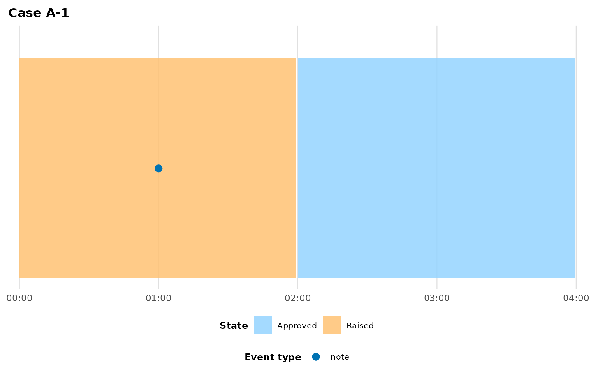

# Adapting your data

``` r

library(eventviz)
```

Every `eventviz` plotting function needs exactly one thing you must
always declare yourself: `state_events`, the `act_type` value(s) that
open a state. There’s no default, and no value-level guessing — if you
omit it, the error tells you what’s actually in your data:

``` r

orders <- data.frame(
  case_id   = c("A-1", "A-1", "A-1"),
  timestamp = as.POSIXct("2026-01-01") + c(0, 3600, 7200),
  act_type  = c("status", "note", "status"),
  activity  = c("Raised", "Chased supplier", "Approved")
)

plot_case_timeline(orders, case_id = "A-1")
#> Error in `require_state_events()`:
#> ! `state_events` is required: name the act_type value(s) that open a
#>   state (a long-running condition), as opposed to point-in-time events.
#> ℹ Distinct act_type values in `data`: "status" (2 rows), "note" (1 row)
#> ℹ Example: `state_events = "status"`
```

The listing is ordered by frequency, so the value you almost certainly
want is usually first:

``` r

plot_case_timeline(orders, case_id = "A-1", state_events = "status")
```



Beyond `state_events`,
[`plot_case_timeline()`](https://jaspercain01.github.io/event-driven-visualisation/reference/plot_case_timeline.md)’s
column-name defaults (`case_col = "case_id"`, `time_col = "timestamp"`,
…) match a lot of data out of the box, but your own data almost
certainly uses different names — and might not even be in the right
*shape* yet. This vignette covers both problems: matching column names
via a schema, and reshaping wide milestone data into the long form
eventviz expects.

## Column-name schemas

You can always pass column names individually:

``` r

plot_case_timeline(
  my_data, case_id = "12345", state_events = "status",
  time_col = "ts", case_col = "record_id", act_type_col = "category",
  activity_col = "label"
)
```

For a dataset you’ll plot repeatedly, bundle the mapping into an
[`event_log_schema()`](https://jaspercain01.github.io/event-driven-visualisation/reference/event_log_schema.md)
once and reuse it:

``` r

my_schema <- event_log_schema(
  time_col = "ts", case_col = "record_id",
  act_type_col = "category", activity_col = "label",
  state_events = "status"
)
my_schema
#> 
#> ── <event_log_schema>
#> time_col: ts
#> act_type_col: category
#> activity_col: label
#> case_col: record_id
#> state_events: status
```

Pass it as `schema = my_schema`; any individual argument you *also*
supply still wins over the schema, and anything neither supplies falls
through to
[`plot_case_timeline()`](https://jaspercain01.github.io/event-driven-visualisation/reference/plot_case_timeline.md)’s
own defaults.

### Autodetection

If your column names are already conventional (`timestamp`/`time`,
`case_id`/`record_id`/`episode_id`, `act_type`/`event_type`,
`activity`/`label`, …), you don’t have to name them at all.
[`autodetect_schema()`](https://jaspercain01.github.io/event-driven-visualisation/reference/autodetect_schema.md)
matches column names against built-in candidate lists — exact
case-insensitive match first, then a fuzzy edit-distance match — and
resolves roles in a fixed order so one column is never silently claimed
by two roles:

``` r

renamed <- data.frame(
  case_idx  = c("A-1", "A-1"),
  event_ts  = as.POSIXct("2026-01-01") + c(0, 3600),
  act_typ   = c("status", "note"),
  activty   = c("Raised", "Chased supplier")
)
autodetect_schema(renamed)
#> Error in `autodetect_schema()`:
#> ! Could not autodetect column(s) for: time_col.
#> ✖ Columns available to match against: "case_idx", "event_ts", "act_typ", and
#>   "activty"
#> ℹ Supply an explicit `event_log_schema()` for the field(s) autodetection could
#>   not resolve.
```

`case_idx`, `event_ts`, `act_typ`, and `activty` were all matched
fuzzily even though none exactly match the candidate lists. To use
autodetection inline rather than as a separate step, pass the literal
string `schema = "auto"` — this is the *only* way autodetection runs; a
manually-constructed
[`event_log_schema()`](https://jaspercain01.github.io/event-driven-visualisation/reference/event_log_schema.md)
never triggers it, and omitting `schema` entirely just uses the
function’s hardcoded defaults:

``` r

plot_case_timeline(example_journey,
                   state_events = c("location_move", "ed_location_move"),
                   schema = "auto")
#> ℹ Autodetected time_col = "timestamp" (exact match).
#> ℹ Autodetected case_col = "case_id" (exact match).
#> ℹ Autodetected act_type_col = "act_type" (exact match).
#> ℹ Autodetected activity_col = "activity" (exact match).
#> ℹ `case_id` not supplied; using the only case "SP-001".
```


If two candidate columns tie for one role, or a required role can’t be
resolved at all,
[`autodetect_schema()`](https://jaspercain01.github.io/event-driven-visualisation/reference/autodetect_schema.md)
aborts naming the problem rather than guessing — at that point, fall
back to an explicit
[`event_log_schema()`](https://jaspercain01.github.io/event-driven-visualisation/reference/event_log_schema.md).

## Reshaping wide milestone data

Some source systems export one row *per case* with a column per
milestone timestamp, rather than one row per event:

``` r

wide <- data.frame(
  case_id        = c("A", "B", "C"),
  category       = c("Hardware", "Software", "Access"),
  received_time  = as.POSIXct(c("2024-01-01 08:00", "2024-01-01 09:15", "2024-01-01 10:00"), tz = "UTC"),
  triage_time    = as.POSIXct(c("2024-01-01 08:10", "2024-01-01 09:20", "2024-01-01 10:05"), tz = "UTC"),
  review_time    = as.POSIXct(c("2024-01-01 11:30", NA,                  "2024-01-01 13:00"), tz = "UTC"),
  closed_time    = as.POSIXct(c("2024-01-01 18:00", "2024-01-01 12:00",  "2024-01-02 09:00"), tz = "UTC")
)
wide
#>   case_id category       received_time         triage_time         review_time
#> 1       A Hardware 2024-01-01 08:00:00 2024-01-01 08:10:00 2024-01-01 11:30:00
#> 2       B Software 2024-01-01 09:15:00 2024-01-01 09:20:00                <NA>
#> 3       C   Access 2024-01-01 10:00:00 2024-01-01 10:05:00 2024-01-01 13:00:00
#>           closed_time
#> 1 2024-01-01 18:00:00
#> 2 2024-01-01 12:00:00
#> 3 2024-01-02 09:00:00
```

[`pivot_events_longer()`](https://jaspercain01.github.io/event-driven-visualisation/reference/pivot_events_longer.md)
reshapes this into the long form
[`plot_case_timeline()`](https://jaspercain01.github.io/event-driven-visualisation/reference/plot_case_timeline.md)
needs, in one call. Name which of the pivoted columns mark a state
change via `state_cols` — they emit `act_type = "state_change"`, which
is exactly what you then pass as `state_events` (everything else pivoted
becomes a point event by default), and any non-pivoted columns (like
`category` here) pass through untouched:

``` r

long <- pivot_events_longer(
  wide,
  case_col   = "case_id",
  time_cols  = c("received_time", "triage_time", "review_time", "closed_time"),
  state_cols = c("received_time", "review_time", "closed_time")
)
#> ℹ Dropped 1 row(s) with NA timestamp (milestone did not occur for that case):
#> • review_time: 1 row(s)
long
#> # A tibble: 11 × 5
#>    case_id timestamp           act_type     activity category
#>    <chr>   <dttm>              <chr>        <chr>    <chr>   
#>  1 A       2024-01-01 08:00:00 state_change Received Hardware
#>  2 A       2024-01-01 08:10:00 triage_time  Triage   Hardware
#>  3 A       2024-01-01 11:30:00 state_change Review   Hardware
#>  4 A       2024-01-01 18:00:00 state_change Closed   Hardware
#>  5 B       2024-01-01 09:15:00 state_change Received Software
#>  6 B       2024-01-01 09:20:00 triage_time  Triage   Software
#>  7 B       2024-01-01 12:00:00 state_change Closed   Software
#>  8 C       2024-01-01 10:00:00 state_change Received Access  
#>  9 C       2024-01-01 10:05:00 triage_time  Triage   Access  
#> 10 C       2024-01-01 13:00:00 state_change Review   Access  
#> 11 C       2024-01-02 09:00:00 state_change Closed   Access
```

Two things happened automatically:

- Case B’s missing `review_time` (`NA`) was dropped with a message,
  rather than becoming a bogus event at a missing timestamp — an `NA`
  milestone means “didn’t happen for this case”, not an error.
- Activity labels were derived from the column names by stripping a
  trailing timestamp suffix (`_time`, `_at`, `_date`, `_ts`,
  `_datetime`) and title-casing what’s left: `"arrival_time"` became
  `"Arrival"`, not `"Arrival Time"`.

Override either behaviour with `act_type_map`/`activity_map` (named
vectors from a `time_cols` entry to your preferred value) if the
auto-derived labels aren’t what you want. The pivot and the plot agree
out of the box — the result feeds straight into
[`plot_case_timeline()`](https://jaspercain01.github.io/event-driven-visualisation/reference/plot_case_timeline.md):

``` r

plot_case_timeline(
  long, case_id = "A",
  case_col = "case_id", state_events = "state_change"
)
```


## Next steps

- [`vignette("linear-processes")`](https://jaspercain01.github.io/event-driven-visualisation/articles/linear-processes.md)
  for processes with no physical locations at all (complaints, tickets,
  approval pipelines).
- [`vignette("cohort-analysis")`](https://jaspercain01.github.io/event-driven-visualisation/articles/cohort-analysis.md)
  for comparing several cases once your data is in the right shape.
