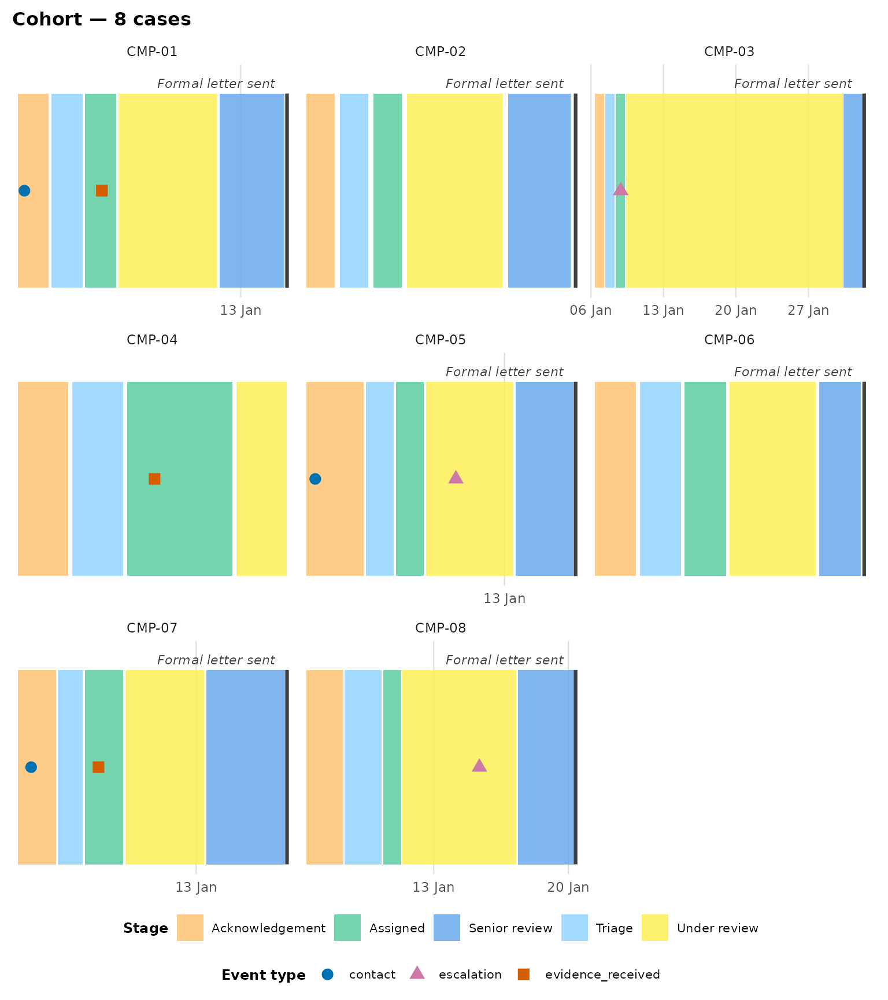
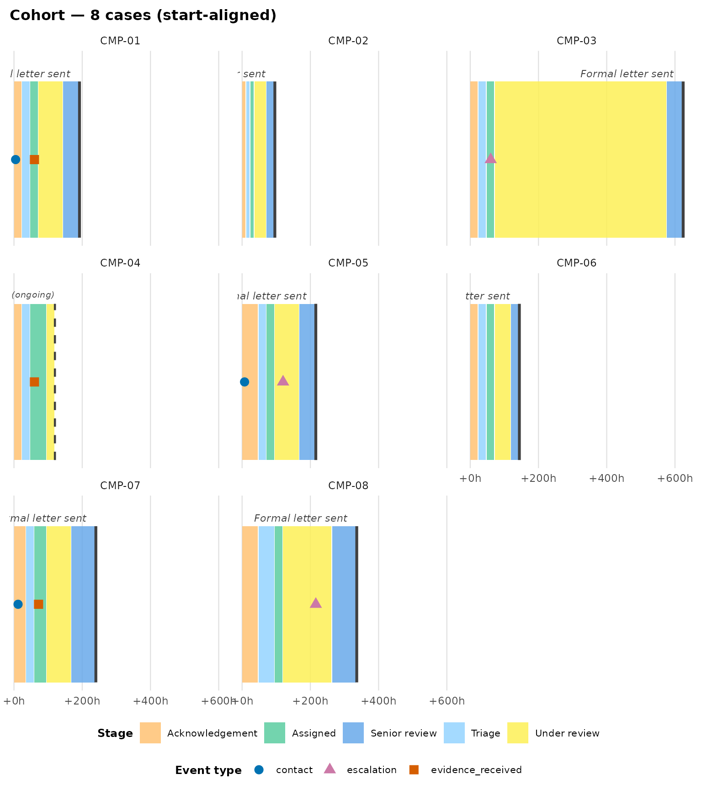
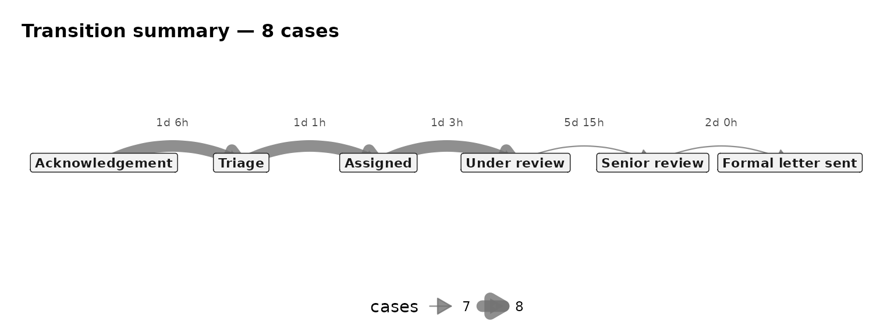

# Cohort analysis

``` r

library(eventviz)
```

Everything so far has looked at one case at a time. This vignette covers
comparing many cases at once: a faceted small-multiples view, and
aggregate statistics (per-state durations, breach rates against a
target, and a transition-flow diagram) across a whole cohort. It uses
`complaint_example`’s eight complaints throughout.

## Faceted comparison: `plot_cohort_timeline()`

[`plot_cohort_timeline()`](https://jaspercain01.github.io/event-driven-visualisation/reference/plot_cohort_timeline.md)
lays several cases out as one facet panel per case. By default
(`case_ids = NULL`) it plots every case in the data, up to a `max_cases`
guard (25, since faceting hundreds of cases is a hang, not a plot — pass
explicit `case_ids` to raise it):

``` r

plot_cohort_timeline(
  complaint_example,
  state_events = "stage_change", case_col = "complaint_id",
  terminal_activities = "Formal letter sent",
  state_label = "Stage"
)
```



Each panel gets its own time axis by default (`align_start = FALSE`), so
absolute dates line up across panels — useful for spotting whether
several complaints were affected by the same event (a staffing gap, a
system outage). The same state keeps the same fill colour in every
panel: the palette is built once, over the union of states across the
whole cohort, not independently per panel.

### Aligning start times

To compare *durations* rather than *dates*, rebase every case to elapsed
hours from its own first state event with `align_start = TRUE`. All
panels then share one `+Nh` axis:

``` r

plot_cohort_timeline(
  complaint_example,
  state_events = "stage_change", case_col = "complaint_id",
  terminal_activities = "Formal letter sent",
  state_label = "Stage", align_start = TRUE
)
```



Now it’s immediately visible that `"CMP-03"`’s bar runs far longer than
the others — the stall in “Under review” this vignette keeps coming back
to.

## Aggregate statistics

Faceting is good for eyeballing a handful of cases; for a whole cohort,
`eventviz` also has numeric summarisers built on the same box-derivation
pipeline, so they describe exactly what the plots draw.

### Per-state duration statistics

``` r

summarise_state_durations(
  complaint_example,
  state_events = "stage_change", case_col = "complaint_id"
)
#> # A tibble: 6 × 7
#>   state      n_cases mean_secs median_secs p25_secs p75_secs n_inferred_excluded
#>   <chr>        <int>     <dbl>       <dbl>    <dbl>    <dbl>               <int>
#> 1 Acknowled…       8   108000        86400    86400   140400                   0
#> 2 Assigned         8    97200        86400    86400    97200                   0
#> 3 Formal le…       7       NA           NA       NA       NA                   7
#> 4 Senior re…       7   172800       172800   129600   216000                   0
#> 5 Triage           8    91800        86400    86400    86400                   0
#> 6 Under rev…       8   487543.      259200   216000   388800                   1
```

Every duration statistic in the package respects `end_inferred`: a
case’s *final* state has no recorded exit, so its dwell is an imputed
rendering convenience, not data. By default it’s excluded from the
mean/median/ quantiles (`n_inferred_excluded` reports how many were
dropped); pass `include_inferred = TRUE` to fold them back in.

### Breach rate against a target

[`summarise_breach_rate()`](https://jaspercain01.github.io/event-driven-visualisation/reference/summarise_breach_rate.md)
reports what fraction of cases exceed a target, either across the whole
case (`scope = "case"`) or within one named state
(`scope = "<state name>"`, e.g. an SLA on how long a complaint may sit
in “Under review”):

``` r

breach <- summarise_breach_rate(
  complaint_example, target_hours = 24 * 7, scope = "Under review",
  state_events = "stage_change", case_col = "complaint_id"
)
breach
#> # A tibble: 7 × 4
#>   case_id elapsed_hours breached end_inferred
#>   <chr>           <dbl> <lgl>    <lgl>       
#> 1 CMP-01             72 FALSE    FALSE       
#> 2 CMP-02             36 FALSE    FALSE       
#> 3 CMP-03            504 TRUE     FALSE       
#> 4 CMP-05             72 FALSE    FALSE       
#> 5 CMP-06             48 FALSE    FALSE       
#> 6 CMP-07             72 FALSE    FALSE       
#> 7 CMP-08            144 FALSE    FALSE
attr(breach, "breach_rate")
#> [1] 0.1428571
```

### Transition flow

[`summarise_transitions()`](https://jaspercain01.github.io/event-driven-visualisation/reference/summarise_transitions.md)
reduces the cohort to directed state-to-state transitions with counts
and mean/median dwell in the origin state;
[`plot_transition_summary()`](https://jaspercain01.github.io/event-driven-visualisation/reference/plot_transition_summary.md)
draws them as a flow diagram, with edge width encoding frequency and
forward/backward transitions bowed opposite ways so re-entries stay
legible:

``` r

plot_transition_summary(
  complaint_example,
  state_events = "stage_change", case_col = "complaint_id"
)
```



Every complaint here follows the same six stages in the same order, so
the diagram is a straight line — the re-entry handling matters more for
cohorts where cases can loop back or skip states (a ticket reopened
after “Resolved”, say).

## Next steps

- [`vignette("linear-processes")`](https://jaspercain01.github.io/event-driven-visualisation/articles/linear-processes.md)
  for the single-case staircase view these aggregates complement.
- [`?plot_case_timeline`](https://jaspercain01.github.io/event-driven-visualisation/reference/plot_case_timeline.md)
  for `return_data = TRUE`’s single-case `summary` element, built on the
  same
  [`summarise_case_durations()`](https://jaspercain01.github.io/event-driven-visualisation/reference/summarise_case_durations.md)
  this vignette uses across a cohort.
