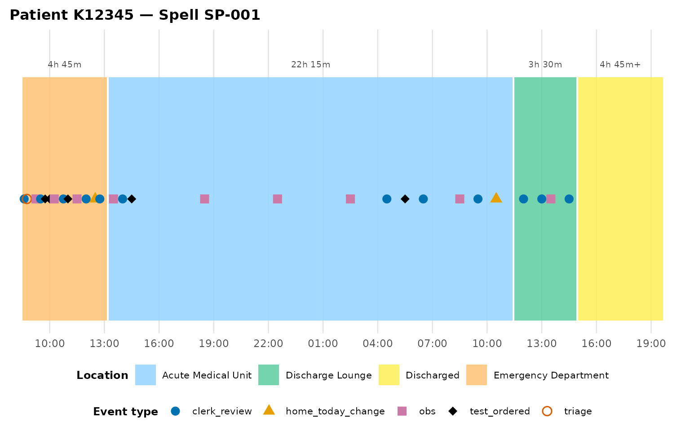
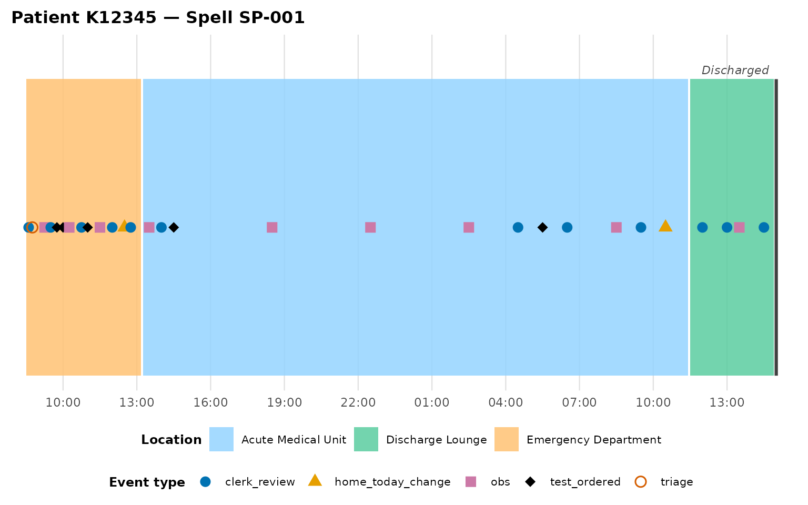
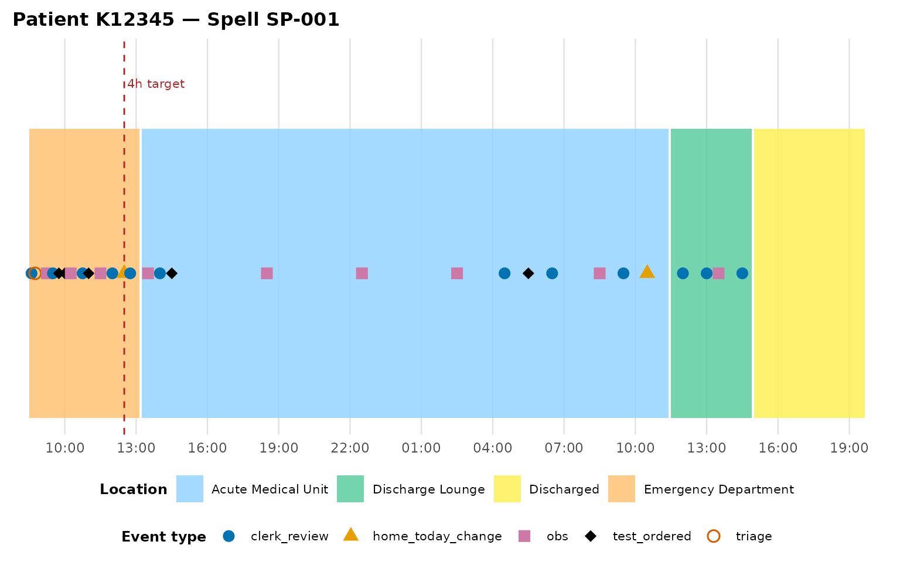
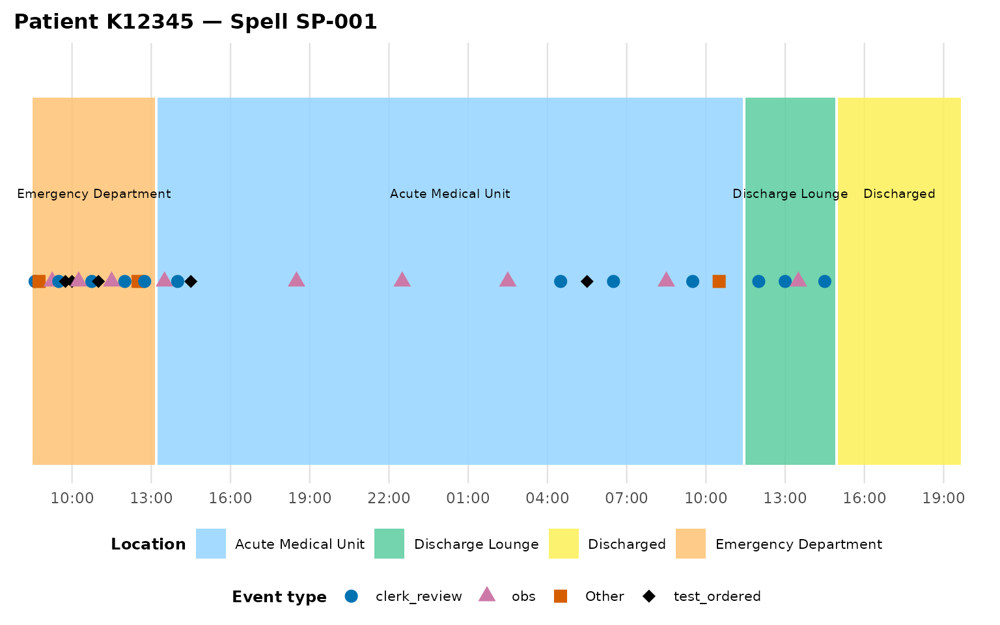

# Getting started

``` r

library(eventviz)
```

This vignette walks through `eventviz`’s core function,
[`plot_patient_journey()`](https://jaspercain01.github.io/event-driven-visualisation/reference/plot_patient_journey.md),
on the bundled `example_journey` dataset: a synthetic patient spell
moving through Ambulance arrival, Emergency Department, Acute Medical
Unit, Discharge Lounge, and Discharged, with clinical point events
(observations, tests, doctor reviews) sprinkled throughout.

## The shape of an event log

[`plot_patient_journey()`](https://jaspercain01.github.io/event-driven-visualisation/reference/plot_patient_journey.md)
expects one row per event, with (at minimum) a case identifier, a
timestamp, an event-type column marking which rows are *moves* to a new
exclusive state, and an activity/label column:

``` r

head(example_journey)
#>   caseID K_Number           timestamp         act_type
#> 1 SP-001   K12345 2024-03-15 08:30:00 ed_location_move
#> 2 SP-001   K12345 2024-03-15 08:36:00     clerk_review
#> 3 SP-001   K12345 2024-03-15 08:45:00           triage
#> 4 SP-001   K12345 2024-03-15 09:15:00              obs
#> 5 SP-001   K12345 2024-03-15 09:30:00     clerk_review
#> 6 SP-001   K12345 2024-03-15 09:45:00     test_ordered
#>                        activity
#> 1          Emergency Department
#> 2 Ambulance handover documented
#> 3  Triage complete - Category 2
#> 4    BP 145/90, HR 88, SpO2 97%
#> 5    Initial nursing assessment
#> 6       FBC, U&E, CRP, Troponin
```

Here `act_type == "ed_location_move"` or `"location_move"` marks a move
to a new location; everything else (`obs`, `clerk_review`,
`test_ordered`, …) is an instantaneous point event that gets plotted on
the timeline but doesn’t create a new box.

## The default plot

``` r

plot_patient_journey(example_journey, case_id = "SP-001")
```


Each coloured box is a location the case occupied over an interval; each
point is an instantaneous event, positioned on the midline of whichever
box it fell inside. The legend splits location fills from event-type
shapes/colours so the two never share a hue by default (the
colourblind-safe `"okabe"` palette — see `?journey_palette` for the
`"brewer"` alternative).

## Duration labels

``` r

plot_patient_journey(example_journey, case_id = "SP-001", show_duration = TRUE)
```



The formatted duration appears above each non-terminal box. If a box’s
end time had to be *inferred* (the data feed stopped before recording
the next move), its label carries a trailing `"+"` so the plot never
overclaims precision it doesn’t have.

## Terminal states

Without more information, the final box in a spell has no natural end —
[`plot_patient_journey()`](https://jaspercain01.github.io/event-driven-visualisation/reference/plot_patient_journey.md)
has to infer one (by default, extending to the last recorded event). For
a spell that reaches a genuinely *terminal* state — “Discharged”,
“Closed”, “Formal letter sent” — that inference is wrong: the case
didn’t spend hours “being Discharged”. Tell the function which
activities are terminal and it renders them as an instantaneous marker
instead:

``` r

plot_patient_journey(
  example_journey, case_id = "SP-001",
  terminal_activities = "Discharged"
)
```



If a case’s data feed simply stops before reaching a terminal state, the
box’s right edge is drawn open (a dashed edge with an italic
`"(ongoing)"` label) rather than silently inventing an end — see the
[linear
processes](https://jaspercain01.github.io/event-driven-visualisation/articles/linear-processes.md)
vignette for a worked example with `support_ticket_example`’s still-open
ticket.

## Reference lines

Overlay a target/threshold line — useful for service standards like a
4-hour ED target:

``` r

plot_patient_journey(
  example_journey, case_id = "SP-001",
  reference_lines = data.frame(offset_hours = 4, label = "4h target")
)
```



`reference_lines` takes a data frame with one row per line:
`offset_hours` (numeric, hours from the spell’s first event) and
`label`.

## Direct labels and event bucketing

For a presentation-ready plot, `label_boxes = TRUE` labels each box
directly at its centre, and `event_type_top_n` collapses a long tail of
rare event types into `"Other"` so the legend stays readable:

``` r

plot_patient_journey(
  example_journey, case_id = "SP-001",
  label_boxes      = TRUE,
  event_type_top_n = 3
)
#> ℹ 2 event type(s) collapsed into "Other" (kept top 3 by frequency):
#>   "home_today_change" and "triage".
```



## Getting the underlying data

Pass `return_data = TRUE` to get the derived tables alongside the plot —
useful for debugging, or for building your own custom visualisation on
top of the same box/event derivation:

``` r

res <- plot_patient_journey(example_journey, case_id = "SP-001", return_data = TRUE)
names(res)
#> [1] "plot"    "boxes"   "events"  "summary"
res$summary
#> # A tibble: 4 × 7
#>   case_id location         xmin                xmax                duration_secs
#>   <chr>   <chr>            <dttm>              <dttm>                      <dbl>
#> 1 SP-001  Emergency Depar… 2024-03-15 08:30:00 2024-03-15 13:15:00         17100
#> 2 SP-001  Acute Medical U… 2024-03-15 13:15:00 2024-03-16 11:30:00         80100
#> 3 SP-001  Discharge Lounge 2024-03-16 11:30:00 2024-03-16 15:00:00         12600
#> 4 SP-001  Discharged       2024-03-16 15:00:00 2024-03-16 19:45:00         17100
#> # ℹ 2 more variables: end_inferred <lgl>, terminal <lgl>
```

`summary` is one row per location stay (case, location, entry/exit,
duration, and whether the end was inferred) — the same shape
[`summarise_journey_durations()`](https://jaspercain01.github.io/event-driven-visualisation/reference/summarise_journey_durations.md)
returns across a whole cohort. See the [cohort
analysis](https://jaspercain01.github.io/event-driven-visualisation/articles/cohort-analysis.md)
vignette for more on aggregating across cases.

## Next steps

- Bringing your own data? See
  [`vignette("adapting-your-data")`](https://jaspercain01.github.io/event-driven-visualisation/articles/adapting-your-data.md)
  for schema autodetection and the wide-to-long pivot wrapper.
- Got a process with no physical locations (a complaint, a ticket, an
  approval pipeline)? See
  [`vignette("linear-processes")`](https://jaspercain01.github.io/event-driven-visualisation/articles/linear-processes.md).
- Comparing many cases at once? See
  [`vignette("cohort-analysis")`](https://jaspercain01.github.io/event-driven-visualisation/articles/cohort-analysis.md).
