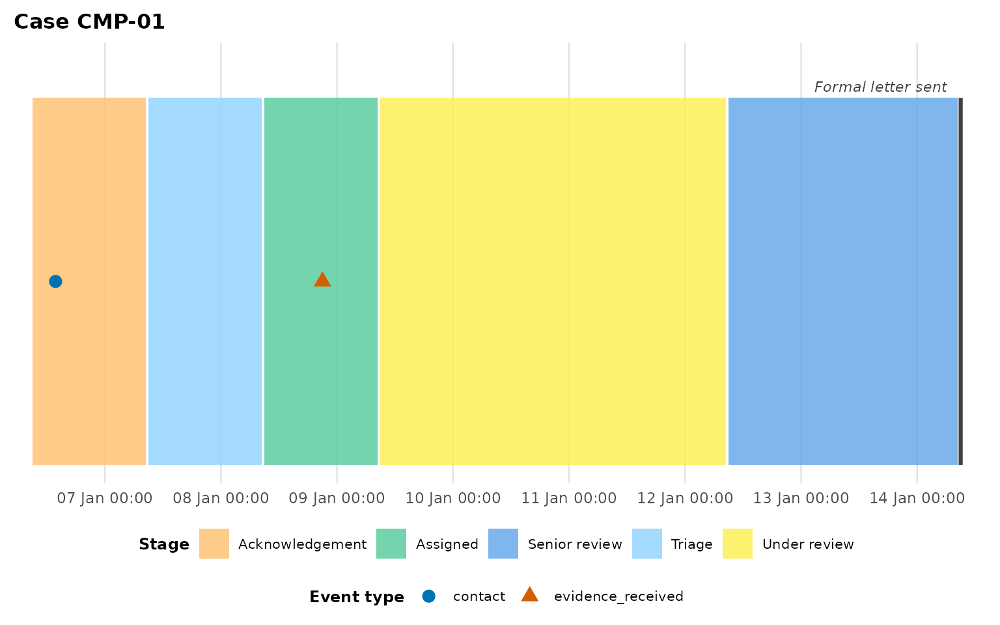
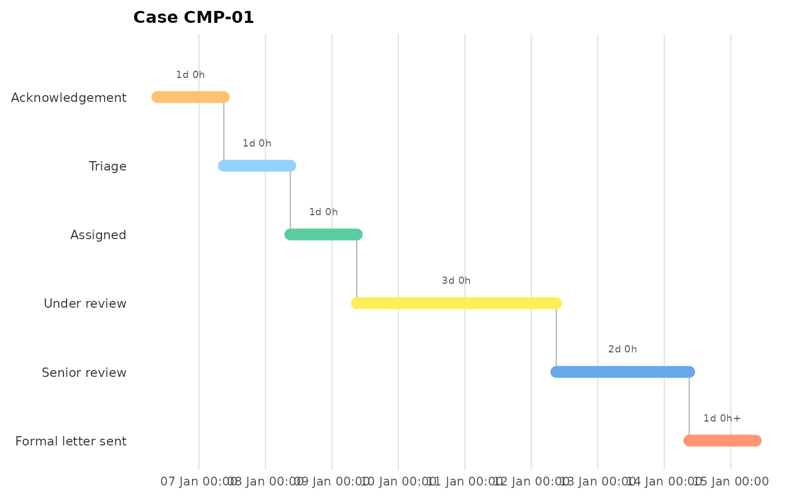
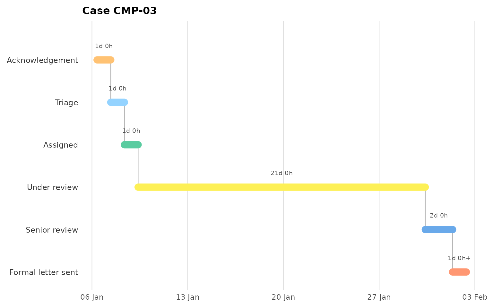
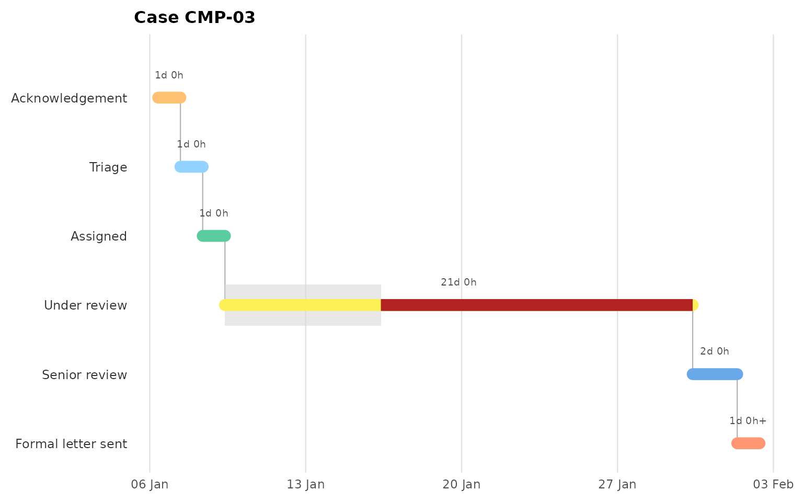
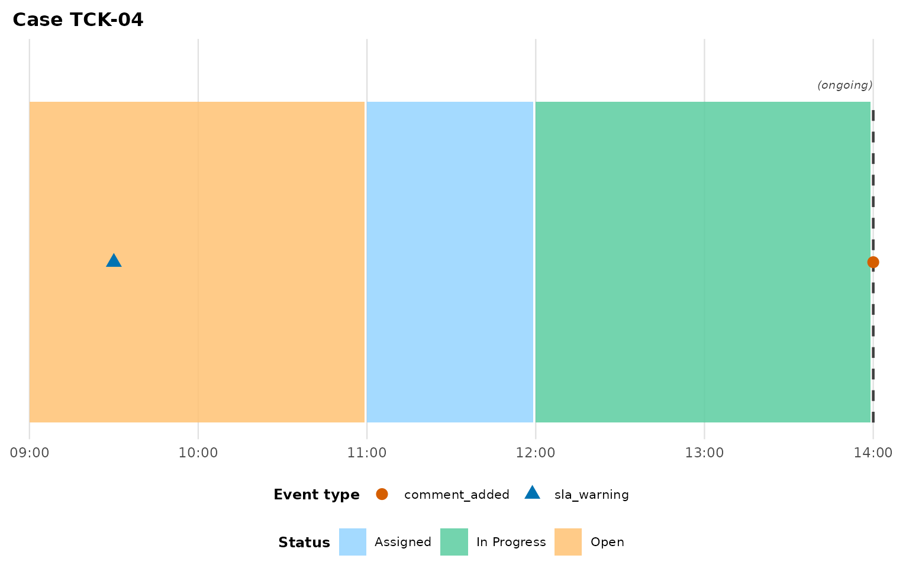

# Linear processes: complaints and tickets

``` r

library(eventviz)
```

Not every event log has a spatial component. A complaint moves through
fixed handling stages; a support ticket moves through fixed statuses; a
purchase order moves through fixed approval steps. None of these cases
occupy a physical *location* — but each occupies exactly one *stage*
exclusively at a time, which is exactly the structure
[`plot_patient_journey()`](https://jaspercain01.github.io/event-driven-visualisation/reference/plot_patient_journey.md)’s
box derivation was built for. This vignette uses the bundled
`complaint_example` and `support_ticket_example` datasets to show both
ways of visualising a linear process, and when to reach for each.

## The datasets

`complaint_example` has eight complaints moving through Acknowledgement
-\> Triage -\> Assigned -\> Under review -\> Senior review -\> Formal
letter sent, recorded as `act_type = "stage_change"`, with no patient
column at all:

``` r

head(complaint_example)
#>   complaint_id           timestamp          act_type                  activity
#> 1       CMP-01 2025-01-06 09:00:00      stage_change           Acknowledgement
#> 2       CMP-01 2025-01-06 13:48:00           contact Phone call to complainant
#> 3       CMP-01 2025-01-07 09:00:00      stage_change                    Triage
#> 4       CMP-01 2025-01-08 09:00:00      stage_change                  Assigned
#> 5       CMP-01 2025-01-08 21:00:00 evidence_received       Case notes received
#> 6       CMP-01 2025-01-09 09:00:00      stage_change              Under review
```

`support_ticket_example` is the same shape for a support-ticket
lifecycle (Open -\> Assigned -\> In Progress -\> Waiting on Customer -\>
Resolved -\> Closed) — deliberately non-healthcare, to prove the package
isn’t NHS-specific.

## Band layout: “what happened when”

[`plot_patient_journey()`](https://jaspercain01.github.io/event-driven-visualisation/reference/plot_patient_journey.md)
works unmodified — `stage_change`/`status_change` plays the role
`location_move` usually plays, `patient_col = NULL` because there’s no
secondary identifier, and `state_label` relabels the fill legend from
“Location” to something that fits:

``` r

plot_patient_journey(
  complaint_example, case_id = "CMP-01",
  location_categories = "stage_change", case_col = "complaint_id",
  patient_col = NULL, terminal_activities = "Formal letter sent",
  state_label = "Stage"
)
```



This is the right view for “what happened, and when” — the point events
(`contact`, `escalation`, `evidence_received`) sit on the timeline
exactly as clinical point events would.

## Staircase layout: “where does the time go”

For a linear process, the more compelling question is usually *where the
time goes* — which stage is eating the SLA.
[`plot_stage_ladder()`](https://jaspercain01.github.io/event-driven-visualisation/reference/plot_stage_ladder.md)
puts stage on the y-axis (first stage at the top) and draws one
horizontal segment per stage, so the case walks down-and-right like a
Gantt chart:

``` r

plot_stage_ladder(
  complaint_example, case_id = "CMP-01",
  stage_categories = "stage_change", case_col = "complaint_id"
)
```



Compare a complaint that stalls for weeks in one stage — the staircase
makes the bottleneck immediately visible in a way the band layout’s
uniform box heights don’t:

``` r

plot_stage_ladder(
  complaint_example, case_id = "CMP-03",
  stage_categories = "stage_change", case_col = "complaint_id"
)
```



### Per-stage targets

Pass `stage_targets` — a named vector of stage name to allowed dwell in
hours — to render a light allowance band on each targeted stage’s row,
with any dwell beyond it redrawn in firebrick:

``` r

plot_stage_ladder(
  complaint_example, case_id = "CMP-03",
  stage_categories = "stage_change", case_col = "complaint_id",
  stage_targets = c("Under review" = 24 * 7)   # one week
)
```



## Still-open cases

`support_ticket_example`’s `"TCK-04"` never reaches `"Closed"` — the
data feed simply stops. Passing `terminal_activities` tells
[`plot_patient_journey()`](https://jaspercain01.github.io/event-driven-visualisation/reference/plot_patient_journey.md)
what “done” looks like, so it can tell the difference between a
completed spell and one still in flight; a case that hasn’t reached a
terminal state gets its final box drawn open (a dashed edge with an
italic `"(ongoing)"` label) instead of silently inventing an end for it:

``` r

plot_patient_journey(
  support_ticket_example, case_id = "TCK-04",
  location_categories = "status_change", case_col = "ticket_id",
  patient_col = NULL, terminal_activities = "Closed", state_label = "Status"
)
```



## Which view should I use?

- **Band layout**
  ([`plot_patient_journey()`](https://jaspercain01.github.io/event-driven-visualisation/reference/plot_patient_journey.md))
  when you want the point events on the same timeline as the stage
  moves, or you’re comparing this process against genuinely spatial ones
  in the same report.
- **Staircase**
  ([`plot_stage_ladder()`](https://jaspercain01.github.io/event-driven-visualisation/reference/plot_stage_ladder.md))
  when the question is “where’s the bottleneck” for one case, especially
  with `stage_targets` set.
- Comparing many cases in either layout at once (rather than one at a
  time)? See
  [`vignette("cohort-analysis")`](https://jaspercain01.github.io/event-driven-visualisation/articles/cohort-analysis.md)
  — the staircase itself stays single-case for now; overlaying several
  cases on one ladder is a documented future direction, not yet
  implemented.
