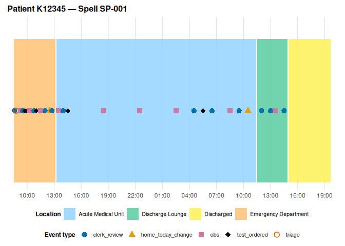
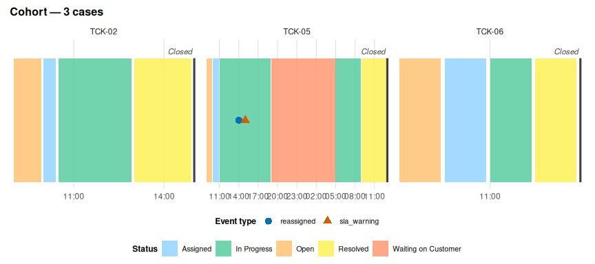

# eventviz

eventviz visualises any timestamped event log — not just clinical data.
If your data has a case, a timestamp, and a state that case occupies
exclusively over time (a hospital ward, a complaint stage, a
support-ticket status, a pipeline step), eventviz turns it into a
timeline, a staircase diagram, a faceted cohort comparison, or an
aggregate statistical summary, with a colourblind-safe default palette
and an interactive tooltip renderer available on request.

## Installation

eventviz isn’t on CRAN. Install the development version from GitHub:

``` r

# install.packages("pak")
pak::pak("JasperCain01/event-driven-visualisation")
```

## Quick start

The package ships `example_journey`, a synthetic patient spell:
Ambulance arrival -\> Emergency Department -\> Acute Medical Unit -\>
Discharge Lounge -\> Discharged, with clinical point events
(observations, tests, doctor reviews) sprinkled throughout.

``` r

library(eventviz)

plot_patient_journey(example_journey, case_id = "SP-001")
```



Turn on a few opt-in features — duration labels, a target-threshold
line, and terminal-state handling so “Discharged” renders as a marker
rather than an invented multi-hour stay:

``` r

plot_patient_journey(
  example_journey, case_id = "SP-001",
  show_duration        = TRUE,
  terminal_activities  = "Discharged",
  reference_lines      = data.frame(offset_hours = 4, label = "4h target")
)
```


## Not just healthcare

Two more example datasets prove the package generalises past clinical
spells: `complaint_example` (an NHS complaint moving through fixed
stages, with no patient column at all) and `support_ticket_example` (a
software support ticket lifecycle — deliberately outside the healthcare
sector entirely).

For a strictly linear process like these,
[`plot_stage_ladder()`](https://jaspercain01.github.io/event-driven-visualisation/reference/plot_stage_ladder.md)
answers “where does the time go” by putting the stage on the y-axis
instead of x, so the case walks down-and-right like a Gantt chart:

``` r

plot_stage_ladder(
  complaint_example, case_id = "CMP-03",
  stage_categories = "stage_change", case_col = "complaint_id",
  stage_targets    = c("Under review" = 24 * 7)   # a one-week target
)
```


[`plot_journey_cohort()`](https://jaspercain01.github.io/event-driven-visualisation/reference/plot_journey_cohort.md)
compares several cases at once as small multiples, and `state_label`
relabels the fill legend for a non-spatial process:

``` r

plot_journey_cohort(
  support_ticket_example,
  location_categories = "status_change", case_col = "ticket_id",
  patient_col = NULL, terminal_activities = "Closed", state_label = "Status",
  case_ids = c("TCK-02", "TCK-05", "TCK-06")
)
```



## Learn more

- [`vignette("getting-started")`](https://jaspercain01.github.io/event-driven-visualisation/articles/getting-started.md)
  — the full clinical walkthrough
- [`vignette("adapting-your-data")`](https://jaspercain01.github.io/event-driven-visualisation/articles/adapting-your-data.md)
  — schema autodetection and the wide-to-long pivot wrapper, for
  bringing your own data
- [`vignette("linear-processes")`](https://jaspercain01.github.io/event-driven-visualisation/articles/linear-processes.md)
  — band vs. staircase for complaints and tickets, and per-stage targets
- [`vignette("cohort-analysis")`](https://jaspercain01.github.io/event-driven-visualisation/articles/cohort-analysis.md)
  — facets plus aggregate/breach/transition summaries across a cohort
